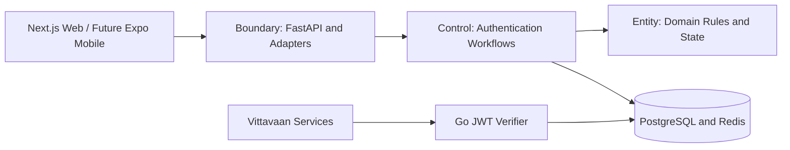

# Vittavaan `auth-core`

Central authentication, session, organization-access, and user-management engine for the Vittavaan web platform and future mobile application.

> **Current phase:** Milestone 1 project foundation is implemented locally and ready for stakeholder review. Authentication features have not yet been implemented.

## In Plain Language

`auth-core` is Vittavaan's secure front door. It verifies who a user is, asks for extra proof when needed, controls which organization and features they may access, and gives trusted short-lived passes to other Vittavaan services.

The first deliverable will be a responsive web MVP that stakeholders and controlled testers can use. A future React Native / Expo mobile app will call the same backend APIs and follow the same security workflows.

## Planned Capabilities

- Email/password, phone OTP, social OIDC, and passkey authentication.
- Adaptive risk checks and mandatory multi-factor authentication.
- Secure access JWTs, refresh-token rotation, replay detection, and session management.
- Organization invitations, context switching, roles, and offboarding.
- Password/contact recovery and governed support actions.
- Four-eyes delayed MFA reset for sensitive administrative recovery.
- Immutable security audit history and GDPR export/erasure workflows.
- Shared contracts for Next.js web and future Expo mobile clients.

## Documentation

The complete review set is indexed in [`docs/README.md`](./docs/README.md).

Recommended starting points:

- [Project overview](./docs/product/project_overview.md)
- [System architecture](./docs/architecture/system_architecture.md)
- [Technology stack](./docs/architecture/technology_stack.md)
- [API contract](./docs/specifications/auth-core_api_spec.md)
- [Methods inventory](./docs/specifications/auth-core_methods_inventory.md)
- [Database specification](./docs/specifications/auth-core_db_schema.md)
- [Sequence diagrams](./docs/use-cases/auth-core_sequence_diagram.md)
- [Functional flowcharts](./docs/use-cases/auth-core_functional_flowchart.md)
- [Implementation roadmap](./docs/delivery/implementation_roadmap.md)
- [Project progress tracker](./docs/delivery/project_progress.md)
- [Screen inventory and approval register](./docs/product/screen_inventory.md)

## Architecture

The backend follows Entity-Boundary-Control separation:



The domain is designed as a modular monolith first. Provider ports keep staging vendors replaceable by AWS services without rewriting business rules.

## Technology Direction

| Layer | MVP | AWS production target |
|---|---|---|
| Web | Next.js + TypeScript | S3/CloudFront or Amplify |
| Mobile | Reserved Expo client | React Native / Expo |
| API | Python 3.12 + FastAPI | ECS Fargate |
| JWT verification | Go | ECS/gateway integration |
| Database | Neon PostgreSQL | RDS/Aurora PostgreSQL |
| Ephemeral state | Upstash Redis | ElastiCache Redis |
| Email/SMS | Resend + restricted Twilio sandbox | SES + SNS/approved provider |
| Secrets/keys | Environment-scoped staging provider | Secrets Manager + KMS |
| Edge/monitoring | Render/provider facilities | CloudFront, WAF, CloudWatch |

Free staging is for demonstrations only. It has no production SLA and must not process real financial or customer data.

## Repository Shape

```text
apps/web/                    Next.js client
apps/mobile/                 Reserved future Expo client
services/auth-api/           FastAPI EBC service and worker
services/jwt-verifier/       Go verification component
packages/                    API client, contracts, tokens, test fixtures
infrastructure/              Local, staging, and AWS deployment definitions
docs/                        Product, requirements, architecture, operations
tests/                       Contract, integration, security, and E2E suites
```

The Milestone 1 foundation now includes the web, API, JWT verifier, shared contract, local service, and automation structure. Additional package, infrastructure, and cross-service test folders will be added only when their milestones require them.

## Delivery Process

1. Approve documentation and resolve open decisions.
2. Build local monorepo, CI, PostgreSQL, and Redis foundation.
3. Implement use cases in traceable milestones.
4. Connect approved web screens and run automated security/E2E tests.
5. Publish controlled free staging for review.
6. Complete AWS production hardening, independent security review, and operational readiness.

## Local Foundation Quick Start

Milestone 1 introduces the development foundation. It does not yet contain account registration or login features.

### Required tools

- Docker Desktop - runs the local website, backend, database, Redis, and test email inbox.
- Node.js 22 and pnpm - build the website.
- Python 3.12 and `uv` - run and test the FastAPI backend.
- Go 1.24 - run and test the JWT verification component.

### Start everything

```bash
cp .env.example .env
make up
```

After the services become healthy, open:

- Website: `http://localhost:3000`
- FastAPI documentation: `http://localhost:8000/docs`
- API health: `http://localhost:8000/health/ready`
- Go verifier health: `http://localhost:8081/health/ready`
- Test email inbox: `http://localhost:8025`

Stop the local environment with:

```bash
make down
```

Run the available automated checks with:

```bash
make test
make lint
make validate
```

Database migrations run automatically during `make up`. They can also be managed directly with:

```bash
make migrate
make migration-check
make test-integration
```

Progress is recorded in [the project progress tracker](./docs/delivery/project_progress.md).

## Security Notice

This repository contains an architecture proposal, not a claim of banking certification or regulatory compliance. Production launch requires independent penetration testing, privacy/legal review, AWS security review, tested backup recovery, incident procedures, and formal risk acceptance.

## Documentation Approval Rule

The supplied wireframes remain the visual baseline. Missing or materially improved screens will be explained and proposed for stakeholder permission before any new wireframe is created.
