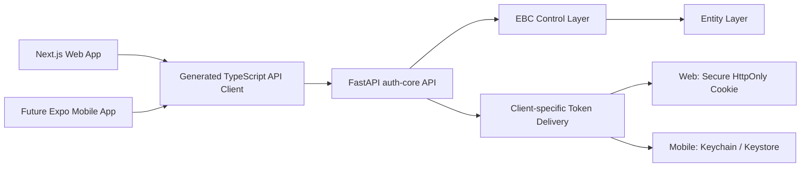

# Web and Mobile Client Reuse Strategy

## Principle

The backend owns authentication behavior. Web and mobile applications present platform-appropriate interfaces but call the same versioned services and receive the same domain errors.



## Shared Assets

The monorepo will provide reusable packages for:

- Generated OpenAPI TypeScript client and DTOs.
- Stable error codes and user-safe message mapping.
- Authentication state-machine definitions.
- Shared field validation that does not contain secrets or security decisions.
- Design tokens for color, typography, spacing, and accessibility.
- Test fixtures and API contract scenarios.

Business authorization, credential validation, rate limits, risk scoring, token creation, and recovery rules remain server-side.

## Platform Differences

| Concern | Web | Mobile |
|---|---|---|
| Refresh token storage | `Secure`, `HttpOnly`, `SameSite=Lax` cookie | iOS Keychain / Android Keystore |
| CSRF | Double-submit token for state-changing cookie requests | Not applicable to bearer-token requests |
| Access token | Memory; never local storage | Memory, restored through secure refresh flow |
| OAuth callback | HTTPS browser callback | Universal link / app link callback |
| Passkeys | Browser WebAuthn APIs | Native platform credential APIs |
| Device signals | Privacy-reviewed browser telemetry | App installation and device security signals |
| Layout | Responsive desktop/tablet/mobile web | Native phone layouts and navigation |

## Repository Preparation

```text
apps/
├── web/       # Initial Next.js client
└── mobile/    # Reserved for future Expo client

packages/
├── api-client/
├── auth-contracts/
├── design-tokens/
└── test-fixtures/
```

The mobile directory will not be populated with unapproved screens during the web MVP. Missing mobile wireframes will be proposed and explained before design work begins.

## Compatibility Rules

1. `/api/v1` behavior remains backward compatible after release.
2. Additive response fields are allowed; breaking changes require a new API version.
3. Client type affects token delivery, not authentication policy.
4. Web and mobile contract tests run against the same API build.
5. OAuth, MFA, and recovery state is server-issued and time-limited; clients do not invent workflow state.
6. No security decision depends solely on client-supplied device information.
