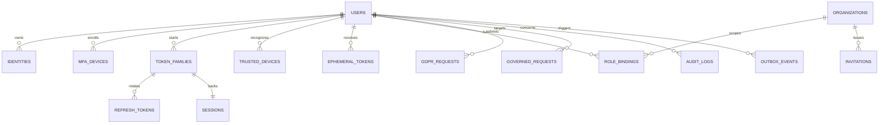

# Data Architecture

## Data Responsibilities

PostgreSQL stores durable identity and governance records. Redis stores expiring, reconstructible security state. Credentials, refresh tokens, OTPs, recovery tokens, and backup codes are never stored in plaintext.

## Logical Entity Relationship Diagram

## Durable Tables

| Table | Purpose | Important constraints |
|---|---|---|
| `users` | Profile and lifecycle state | Case-insensitive unique normalized email; version column for concurrency. |
| `identities` | Password or federated identities | Unique provider + provider subject; password hash only for password type. |
| `password_history` | Previous password hashes | Bounded history; separate rows rather than mutable JSON. |
| `mfa_devices` | TOTP, SMS, email, or passkey factors | Encrypted secret or public credential fields by type; soft revocation. |
| `webauthn_credentials` | Passkey public keys and counters | Globally unique credential ID; monotonic counter handling. |
| `refresh_token_families` | One long-lived device lineage | Absolute expiry, revocation reason/time, device binding. |
| `refresh_tokens` | Every refresh generation hash | Single-use state allows replay detection after rotation. |
| `sessions` | User-visible active session | Family, client, organization, device, last activity, revocation. |
| `trusted_devices` | Risk history | Unique user/fingerprint; bounded risk metadata. |
| `ephemeral_tokens` | Durable verification/reset links | Hash, purpose, expiry, single consumption. |
| `organizations` | Tenant records | Stable identifier and lifecycle state. |
| `invitations` | Organization onboarding | Hashed token, role intent, expiry, acceptance state. |
| `role_permission_catalog` | Canonical role definitions | Versioned module/role/permission mapping. |
| `user_role_bindings` | User role assignment | Unique active user/org/module/role binding. |
| `governed_requests` | Four-eyes and delayed actions | Initiator differs from approver; execute-after timestamp. |
| `gdpr_requests` | Export and erasure lifecycle | State machine, timestamps, artifact reference. |
| `audit_logs` | Append-only security history | No update/delete application grants; tamper-evident linkage. |
| `outbox_events` | Reliable async work | Claimed/attempted status, idempotency key, redacted payload. |

## Redis Keyspace

| Pattern | TTL | Purpose |
|---|---:|---|
| `auth:mfa-challenge:{opaque}` | 5 minutes | Step-up context and permitted factors. |
| `auth:otp:{user}:{purpose}` | 3 minutes | Hashed OTP and attempt counter. |
| `auth:webauthn:{challenge}` | 5 minutes | Registration or assertion challenge. |
| `auth:rate:{route}:{subject}` | Window-specific | Atomic rate limits. |
| `auth:lock:mfa:{factor}` | 15 minutes | Temporary factor lock after repeated failures. |
| `auth:revocation:jti:{jti}` | Remaining access lifetime | Immediate access-token revocation. |
| `auth:revocation:user:{user}` | 30 days | Reject tokens issued before global logout time. |
| `auth:revocation:org:{user}:{org}` | 30 days | Reject prior tenant-scoped tokens after offboarding. |
| `auth:risk:{user}:{fingerprint}` | 30 days | Bounded recent risk signals. |

Critical approvals and durable recovery state do not exist only in Redis.

## Tenant Isolation

- Every tenant-owned record carries `org_id`.
- Controls set a transaction-local organization context after verifying membership.
- PostgreSQL RLS prevents access outside that context.
- Administrative service roles are separate and audited.
- Integration tests attempt cross-tenant reads and writes directly against repositories.

## Audit Integrity

- Application role has `INSERT` and authorized `SELECT`, never `UPDATE` or `DELETE`.
- Database trigger rejects mutation regardless of ORM behavior.
- Each record includes actor, subject, action, outcome, correlation ID, time, network context, and redacted metadata.
- Tamper-evident hash chaining or an AWS WORM export target is added before production.
- Passwords, tokens, OTPs, private keys, full provider assertions, and unnecessary PII are prohibited from audit metadata.

## Encryption and Hashing

- Passwords: Argon2id with versioned parameters.
- Random bearer secrets: SHA-256 or keyed HMAC hashes for lookup and comparison.
- TOTP secrets and sensitive provider material: envelope encryption.
- Transport: TLS everywhere outside local development.
- Production master keys: AWS KMS; private JWT signing keys are non-exportable where supported.

## Retention and Privacy

Retention periods are configuration-backed policies requiring legal approval before production. The design separates identity data, security telemetry, audit obligations, and export artifacts so each can have a distinct lawful retention policy.

GDPR erasure disables access, revokes sessions, removes or irreversibly anonymizes PII, preserves legally required pseudonymous audit evidence, and records completion. Backup expiry is handled operationally rather than by mutating immutable snapshots.
