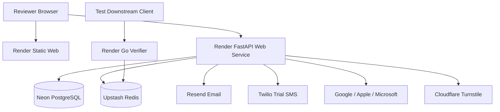
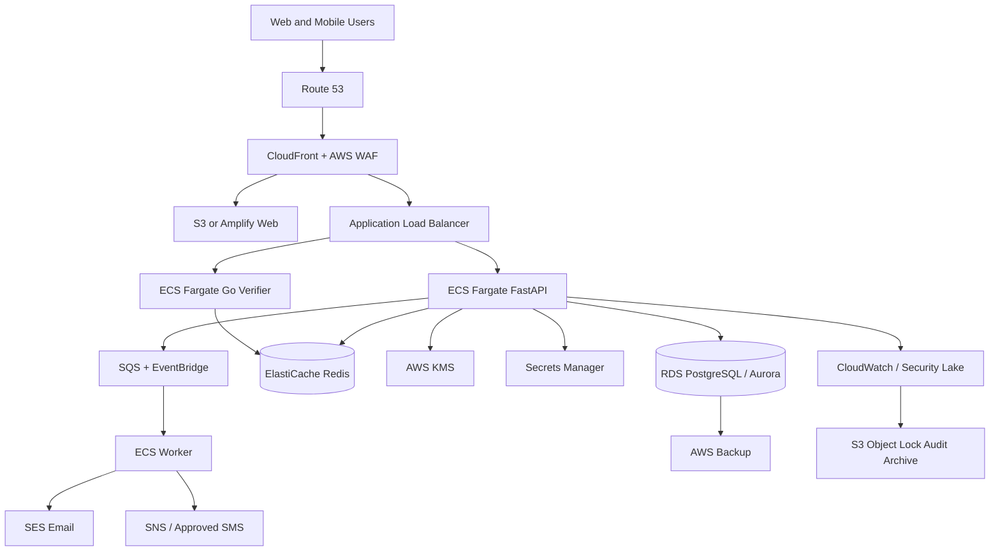

# Deployment Architecture

## Environments

| Environment | Purpose | Data policy |
|---|---|---|
| Local | Development and automated tests | Synthetic data only |
| CI | Ephemeral validation | Generated test fixtures only |
| Staging MVP | Stakeholder and controlled tester review | Test accounts; no financial data |
| AWS pre-production | Production-like verification | Synthetic or approved masked data |
| AWS production | Real platform operation | Governed customer data |

## Local Environment

Docker Compose runs Next.js, FastAPI, worker, Go verifier, PostgreSQL, Redis, and Mailpit. Provider ports can use deterministic fakes while contract tests exercise sandbox clients separately.

## Free Staging MVP

Render free services may cold-start and are not production infrastructure. Twilio trial delivery is restricted to verified recipients. Staging visibly identifies itself as a test system.

## AWS Production Target

## Portability Mapping

| Capability | Staging | AWS production |
|---|---|---|
| Web hosting | Render static site | S3/CloudFront or Amplify |
| Containers | Render web services | ECS Fargate |
| PostgreSQL | Neon | RDS PostgreSQL/Aurora |
| Redis | Upstash | ElastiCache |
| Encryption | Local envelope provider | AWS KMS |
| Secrets | Render environment secrets | Secrets Manager |
| Email | Resend sandbox | SES |
| SMS | Twilio trial | SNS or approved provider |
| Jobs | Database outbox poller | SQS/EventBridge + worker |
| Monitoring | Render/provider logs | CloudWatch, alarms, tracing |

## Availability and Recovery Targets

Exact production SLO, RTO, and RPO values require business approval. The architecture supports multi-AZ databases, automated backups, point-in-time recovery, immutable audit export, horizontally scaled stateless services, and tested rollback.

## Deployment Pipeline

1. Pull request runs tests, contract checks, security scans, and image builds.
2. Merge to protected `main` produces immutable versioned images.
3. Staging deploy runs migrations as a controlled release step and performs smoke tests.
4. Production promotion uses the same image digest with environment-specific configuration.
5. Rollback never assumes destructive down-migrations; schema changes use expand/migrate/contract sequencing.
