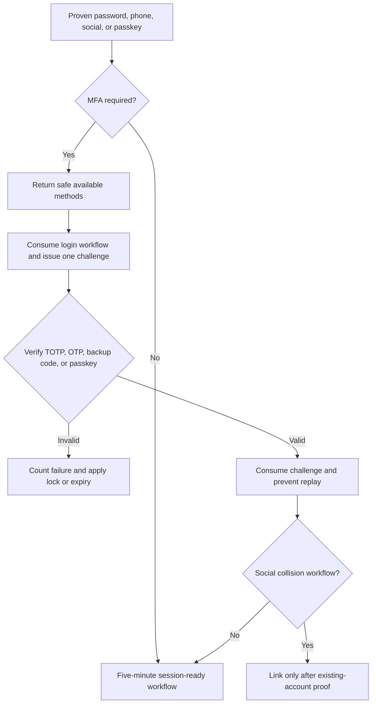

# Delivered MFA and Passkey Foundation

## In Plain Language

Milestone 5 adds the second security check that protects an account when a password is stolen or a login comes from an unfamiliar device. The website and future mobile application call the same service, so the security rules are implemented once rather than copied into each app.

This milestone still does **not** create JWTs, cookies, or long-lived sessions. After successful MFA, `auth-core` returns a new five-minute `session_ready` workflow token. Milestone 6 will exchange that proven workflow for the correct web or mobile session.

## Supported Security Methods

| Method | User experience | Main protection |
|---|---|---|
| Authenticator app | Scan an enrollment QR representation or enter the manual secret, then provide a six-digit rotating code. | AES-256-GCM encrypted secret, 30-second TOTP, one-step clock tolerance, time-step replay prevention, and a 15-minute factor lock after three failures. |
| Email OTP | Receive a six-digit code at a verified, masked email address. | Keyed hash in Redis, three-minute expiry, three attempts, send throttling, and single-use consumption. |
| SMS OTP | Receive a six-digit code at a verified, masked phone number. | The same OTP protections plus SMS-pumping rate limits. |
| Passkey | Use Face ID, Touch ID, Windows Hello, Android biometrics, device PIN, or a security key. | WebAuthn RP ID, origin, challenge, user-verification, signature, credential, backup-state, and counter checks. |
| Backup code | Enter one emergency code saved during first strong-factor enrollment. | Ten high-entropy codes shown once, stored only as keyed hashes, and atomically removed after one use. |

## Safe First-Login Bootstrap

A newly registered user has no authenticator or passkey yet. Requiring an existing factor would create a dead end. The service therefore permits a verified email or phone OTP to complete the first unfamiliar-device login. That proven primary workflow may enroll the user's first authenticator or passkey.

After a strong factor exists, enrolling, listing, or removing factors requires a workflow that has already completed MFA. A stolen password alone cannot manage existing security factors.

## Workflow

## Enrollment and Secret Handling

- TOTP setup returns the manual secret and provisioning URI only during the initial setup response.
- PostgreSQL receives only AES-GCM ciphertext bound to the user's ID as authenticated context.
- Local development uses a dedicated 256-bit key; production must replace this adapter with AWS KMS envelope encryption.
- Passkeys store only the public credential, credential ID, safe transports, backup flags, and signature counter. The private key remains on the user's authenticator.
- Backup codes are never encrypted for later recovery because the server does not need their plaintext; only keyed hashes are stored.

## Factor-Management Rules

- Factor lists never return TOTP secrets, passkey public keys, credential IDs, counters, OTPs, or backup-code hashes.
- A user cannot remove their last active authenticator or passkey; a replacement strong factor must be enrolled first.
- Factor-management workflows require completed MFA assurance and are short-lived.
- Social identity collisions retain provider proof only in expiring Redis workflow state and link only after the existing account is proven.

## API Endpoints

| Method | Path | Purpose |
|---|---|---|
| `GET` | `/api/v1/auth/mfa/methods` | List methods safe for the current workflow. |
| `POST` | `/api/v1/auth/mfa/challenge` | Issue a TOTP, email, SMS, or backup-code challenge. |
| `POST` | `/api/v1/auth/mfa/challenge/resend` | Replace an eligible email or SMS code. |
| `POST` | `/api/v1/auth/mfa/verify` | Verify and consume a challenge. |
| `POST` | `/api/v1/auth/mfa/totp/setup` | Begin authenticator enrollment. |
| `POST` | `/api/v1/auth/mfa/totp/confirm` | Prove the first TOTP and activate the factor. |
| `POST` | `/api/v1/auth/mfa/passkeys/options` | Begin passkey enrollment. |
| `POST` | `/api/v1/auth/mfa/passkeys/confirm` | Verify attestation and save the public credential. |
| `POST` | `/api/v1/auth/passkeys/options` | Begin primary or step-up passkey authentication. |
| `POST` | `/api/v1/auth/passkeys/verify` | Verify the signed WebAuthn assertion. |
| `POST` | `/api/v1/auth/identities/collision/prove` | Prove an existing password before social linking. |
| `GET` | `/api/v1/auth/mfa/devices` | List active factors without secrets. |
| `DELETE` | `/api/v1/auth/mfa/devices/{mfa_id}` | Revoke a factor while preserving a strong replacement. |

## Implementation Standards

- `PyOTP` implements RFC 6238-compatible TOTP generation and verification.
- `py_webauthn` verifies browser-standard WebAuthn registration and authentication responses.
- `cryptography` provides authenticated AES-256-GCM local secret encryption.
- PostgreSQL transactions protect factor activation, backup-code consumption, identity linking, and signature-counter changes.
- Redis provides expiring and single-use login, MFA, OTP, and WebAuthn state.

## Deliberate Boundaries

- The frontend does not yet call `navigator.credentials.create()` or `navigator.credentials.get()`; that begins after the proposed screens are approved.
- Production KMS, SES, and SMS adapters require AWS/provider configuration in later deployment work.
- Milestone 6 consumes the final workflow and creates sessions, cookies, access tokens, and rotating refresh tokens.

## Automated Evidence

- Unit tests cover encryption tamper detection, TOTP time-step replay, three-strike locks, OTP replay, backup-code replay, collision proof, factor-management assurance, and passkey challenge replay.
- API tests prove the web/mobile contract, RFC 7807 errors, masked destinations, no-store headers, and the absence of premature tokens.
- PostgreSQL and Redis integration tests prove encrypted TOTP storage, hashed backup codes, active-factor persistence, expiring challenges, one-time state, and migration correctness.
