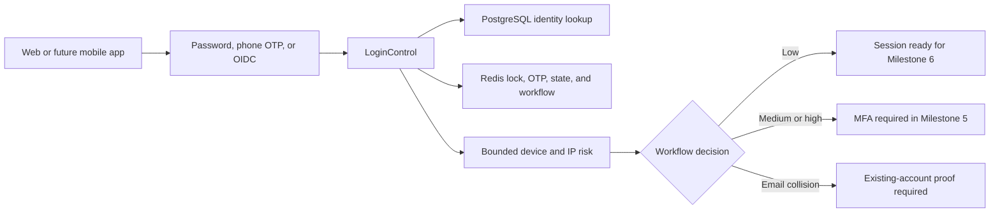

# Delivered Primary Authentication Foundation

## In Plain Language

This milestone gives `auth-core` the shared backend rules for checking a person's first proof of identity. A website or future mobile app can use the same API for password, phone-code, or social login, so security behavior is maintained in one place.

Successful primary proof does **not** yet create a login session or JWT. Instead, the service returns a short-lived, meaningless-to-an-attacker workflow token and one of three decisions:

- `session_ready`: primary proof and current risk checks passed; Milestone 6 may create a session.
- `mfa_required`: another security check must be completed in Milestone 5.
- `collision_proof_required`: a social email matches an existing account and ownership must be proved before linking.

## Supported Login Paths

| Path | What happens | Main protection |
|---|---|---|
| Password | Finds an active password identity and verifies its Argon2id hash. | Unknown and wrong accounts receive the same error and both perform password-hash work. |
| Phone OTP | Sends a six-digit code to a verified phone and confirms it. | CAPTCHA, request limits, keyed hashing, three-minute expiry, attempt limit, and one-time Redis consumption. |
| Social OIDC | Starts a provider-neutral authorization workflow and verifies its callback. | Single-use state, nonce, PKCE binding, issuer, audience, verified email, and provider subject. |
| Fallback | Lists available methods for a valid login workflow. | The list requires an opaque five-minute workflow token. |

Google is the first planned external staging provider. The control and API boundaries also allow Apple and Microsoft without changing the web or future mobile contract. Local development uses a signed simulator and cannot be enabled as the production provider.

## Temporary Lock and Privacy

- Five failed password attempts within the rate window create a 15-minute temporary lock for the email and, when available, the source IP.
- Public password failures never reveal whether an account exists, is unverified, suspended, or has the wrong password.
- Phone-code requests always return the same acceptance message whether or not the phone belongs to an eligible account.
- Raw passwords, phone OTPs, device fingerprints, OIDC state, and workflow tokens are never written to PostgreSQL or audit metadata.

## Bounded Risk Decision

The current risk model is deliberately small and explainable:

| Signal | Score |
|---|---:|
| Device has not been seen for the user | +50 |
| Device is known but not trusted | +20 |
| Known device's IP has changed | +30 |

Scores below 25 are low risk, 25-49 are medium, and 50 or more are high. Medium and high outcomes require MFA. A fingerprint or IP address only changes risk; it can never authenticate a person by itself.

## Shared API Flow

## API Endpoints

| Method | Path | Purpose |
|---|---|---|
| `POST` | `/api/v1/auth/login` | Verify an email and password. |
| `POST` | `/api/v1/auth/login/phone/request` | Safely request a phone login code. |
| `POST` | `/api/v1/auth/login/phone/confirm` | Consume the phone code and evaluate risk. |
| `POST` | `/api/v1/auth/sso/{provider}/authorize` | Start OIDC with state, nonce, and PKCE. |
| `POST` | `/api/v1/auth/sso/{provider}/callback` | Verify the provider response and prevent unsafe linking. |
| `GET` | `/api/v1/auth/fallback-options` | List safe methods for a valid workflow. |

## Deliberate Boundaries

- Milestone 5 completes MFA, passkeys, and collision ownership proof.
- Milestone 6 creates access tokens, refresh tokens, cookies, and sessions.
- Production Google, Apple, and Microsoft adapters require approved client credentials and redirect URLs.
- Device trust promotion requires a completed strong-authentication workflow; primary login does not trust a device automatically.

## Automated Evidence

- Unit tests cover anti-enumeration work, temporary locks, risk decisions, phone replay, OIDC replay, and collision blocking.
- API tests prove the shared response contract, generic failures, and absence of premature tokens.
- Redis integration tests prove expiring locks/workflows and one-time OIDC state consumption.
- Static checks enforce formatting and strict Python types.
