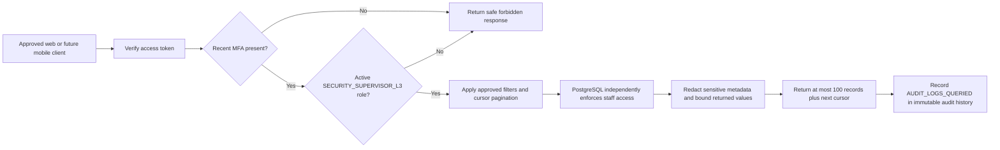

# Delivered Privacy and Audit Foundation

## In Plain Language

Milestone 9 begins by letting specifically authorized security supervisors review security history without exposing passwords, tokens, contact details, or other unnecessary private information. Ordinary users and other staff roles cannot use this cross-user audit view.

This service is shared by the website and future mobile application. No frontend screen or wireframe was created or changed.

## Delivered Audit Flow

## Security Rules

| Rule | Delivered behavior |
|---|---|
| Strong verification | The caller must have a recent MFA assurance method. |
| Staff authority | The role comes from `staff_role_bindings`, never from request data or organization membership. |
| Least privilege | Cross-user audit search is limited to active `SECURITY_SUPERVISOR_L3` staff. |
| Database enforcement | PostgreSQL row-level security independently checks the same role. |
| Safe filtering | Search supports subject, event, outcome, time range, and an opaque cursor. |
| Bounded results | Each response contains 1 to 100 records. |
| Privacy redaction | Metadata keys related to credentials, tokens, codes, contact details, evidence, and network identifiers are replaced with `[REDACTED]`. |
| Tamper resistance | Application roles cannot update, delete, or truncate audit records; a database trigger rejects mutation. |
| Audit of access | Every successful audit search creates an `AUDIT_LOGS_QUERIED` record. |

## Remaining Milestone 9 Work

- User data-export requests and encrypted, expiring artifacts (`UC-601`).
- Account-erasure requests, access revocation, and irreversible anonymization (`UC-602`).
- Configuration-backed retention and documented backup-expiry operations.
- Privacy and audit screens only after project-owner design approval.
