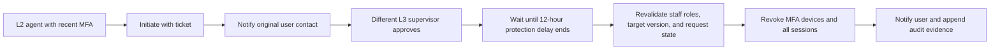

# Recovery and Controlled Administration Foundation

## In Plain Language

Milestone 8 provides safe ways to regain account access without creating an easy path for attackers or dishonest support staff.

The same backend services are available to the website and future mobile app. This milestone does not create or change frontend screens; the existing wireframes remain the baseline, and missing recovery or staff screens still require owner permission before visual implementation.

## Delivered Journeys

| Journey | What the system does | Main protection |
|---|---|---|
| Forgotten password | Returns the same message for every email and conditionally sends a 15-minute reset link. | Prevents account discovery; limits requests to three per hour. |
| Password reset | Consumes one hashed link, checks policy, HIBP breach status, and recent password history, then stores Argon2id. | Prevents link replay, breached passwords, and recent password reuse. |
| Contact change | Sends separate six-digit proofs to the old and new email or phone. | Applies the change only after both channels are proven within ten minutes. |
| Account unlock | Lets an L2 support agent release a temporary lock with recent MFA and a ticket reference. | Staff authority is read from PostgreSQL, not accepted from the request. |
| Account suspension | Lets an account administrator suspend access and revoke every session immediately. | Prevents a suspended account from continuing with an older token. |
| Support recovery | Lets verified L2 support issue a single-use recovery link after recording a ticket and bounded evidence reference. | Does not store identity documents in recovery metadata. |
| Governed MFA reset | Separates L2 initiation, L3 approval, and delayed execution. | Distinct actors, target-version check, 12-hour delay, user notification, and complete audit evidence. |

## Password Reset Flow

1. The client sends an email address.
2. Redis applies the same rate limit whether the account exists or not.
3. An eligible account receives a random link; PostgreSQL stores only its keyed hash.
4. The public response never confirms whether the account exists.
5. The submitted password passes length, HIBP, and the last five password checks.
6. PostgreSQL locks and consumes the token while replacing the Argon2id hash.
7. All sessions and refresh families are revoked through PostgreSQL and Redis.
8. The user receives a password-changed security alert.

## Four-Eyes MFA Reset

The request cannot be self-approved, executed early, reused after execution, or applied after the target account changes.

## Database Additions

| Table/change | Purpose |
|---|---|
| `staff_role_bindings` | Separates global support/security authority from organization portfolio roles. |
| `contact_change_requests` | Stores hashed dual-channel proofs and bounded workflow state. |
| `governed_requests` additions | Records target version, approval time, and execution time. |
| `ephemeral_tokens` purpose | Adds support-recovery links while preserving hashed, expiring, single-use behavior. |
| `password_history` backfill | Ensures existing password identities participate in recent-password checks. |

## Staff Role Boundaries

| Role | Allowed Milestone 8 action |
|---|---|
| `SUPPORT_AGENT_L2` | Unlock after verification, issue support recovery, initiate MFA reset. |
| `SECURITY_SUPERVISOR_L3` | Approve, inspect, and execute a matured MFA reset. |
| `ACCOUNT_ADMIN` | Suspend an account and revoke access. |

Staff-role grants are operational security actions and are not exposed as a public self-service API.
The normal application database role has read-only access to these bindings and cannot grant, change, or revoke its own staff authority. Contact-change rows use PostgreSQL row-level security so an application transaction can access only the current user's workflow.

## Audit and Privacy

- Tokens, passwords, OTPs, full recovery links, and evidence documents are never written to audit metadata.
- Mutations record actor, subject, event, outcome, correlation ID, and bounded ticket/reference metadata.
- Existing append-only audit database protections remain active.
- Contact and recovery responses expose workflow status, never secret codes or full stored credentials.

## AWS Production Direction

- Replace Mailpit with approved SES/SNS delivery while keeping the notification port unchanged.
- Store peppers and signing/encryption material in Secrets Manager and KMS.
- Run matured governed actions through a durable worker with idempotent scheduling.
- Alert security operations on recovery abuse, account suspension, and governed-reset transitions.
