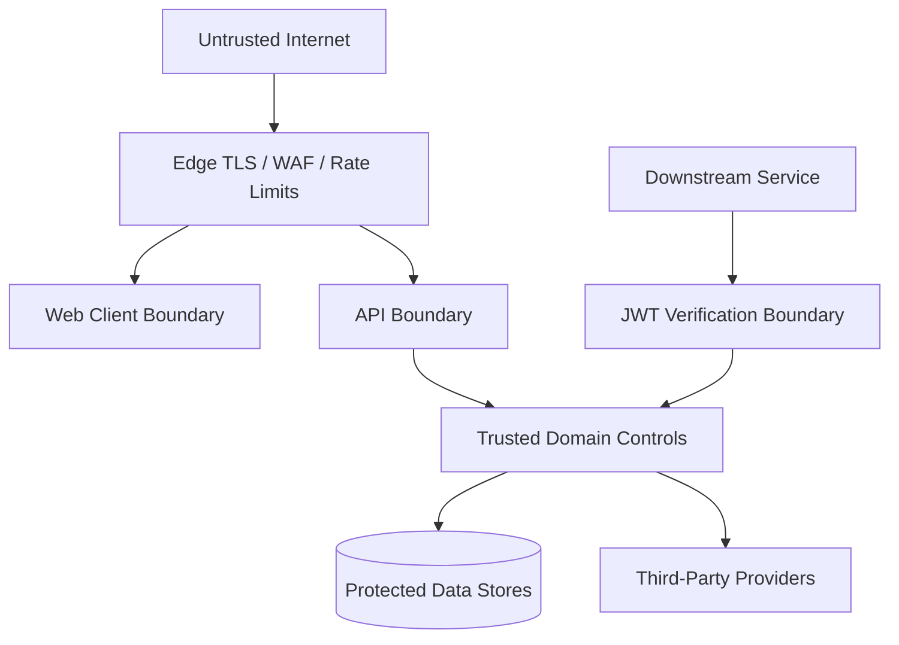

# Security Architecture

## Security Objectives

- Prevent credential disclosure and account takeover.
- Detect replay and revoke compromised sessions quickly.
- Enforce least privilege and tenant isolation.
- Make privileged recovery resistant to insider abuse.
- Preserve useful, privacy-conscious, tamper-resistant evidence.
- Keep security policy on the server for every client.

## Trust Boundaries

All client data, forwarded headers, device signals, OAuth assertions, provider callbacks, and downstream requests are untrusted until validated.

## Primary Controls

| Area | Planned controls |
|---|---|
| Passwords | Argon2id, breach check, password history, anti-enumeration, secure reset. |
| MFA | TOTP/passkeys preferred, OTP expiry/attempt limits, backup recovery, step-up assurance. |
| Tokens | RS256, `kid`, strict issuer/audience/time checks, 15-minute access maximum, refresh rotation. |
| Replay | Every refresh generation retained as a hash; reuse revokes the family and raises an alert. |
| Sessions | Device binding, idle/absolute expiry, session cap, single/global/org revocation. |
| Web | HttpOnly/Secure cookies, SameSite, CSRF, restrictive CORS/CSP, no token local storage. |
| Mobile | Keychain/Keystore, PKCE, verified app links, no embedded client secret. |
| Tenancy | Membership check, scoped claims, RLS, explicit admin roles, cross-tenant tests. |
| Administration | Dedicated routes, strong MFA, least privilege, four-eyes approvals, delay windows. |
| Integrations | TLS, timeouts, retries only where safe, signed callbacks, secret rotation, fail-closed defaults. |
| Audit | Append-only role, mutation trigger, redaction, correlation IDs, security alerts. |

## Authentication Assurance

Authentication context records the methods and time of authentication. Sensitive actions can require recent MFA or a phishing-resistant passkey instead of trusting an old session.

Risk assessment is additive, explainable, and bounded. Device fingerprinting or IP location alone never authenticates a user or automatically denies permanent access.

## JWT Profile

Required claims are `iss`, `sub`, `aud`, `jti`, `iat`, `nbf`, `exp`, `client_type`, authentication context, active organization where applicable, and versioned role claims.

Verification rejects:

- Unknown algorithms or missing key IDs.
- Issuer or audience mismatch.
- Expired, premature, malformed, or excessively long-lived tokens.
- Revoked token IDs or tokens issued before user/org revocation timestamps.
- Missing organization context on tenant-protected operations.

## Four-Eyes Governance

1. An authorized L2 agent initiates a request with a support ticket.
2. The target user is notified through established channels.
3. A distinct L3 supervisor approves the request.
4. Approval does not bypass the documented 12-hour execute-after time.
5. A durable worker revalidates state and authorization before execution.
6. MFA is revoked, sessions terminate, and every step is audited.

Initiation, approval, and execution are separate state transitions. No caller may approve their own request.

## Threat Scenarios Requiring Tests

- Credential stuffing, email enumeration, and SMS pumping.
- Stolen or replayed refresh tokens.
- OAuth email collision and account-link takeover.
- CSRF, XSS token theft, callback manipulation, and open redirects.
- WebAuthn challenge replay and signature-counter anomalies.
- Cross-tenant object access and forged role claims.
- Insider self-approval or cooldown bypass.
- Audit mutation, log injection, and secret leakage.
- Redis, database, email, SMS, OIDC, KMS, or network outage.

## Production Security Gates

- Independent threat-model review and penetration test.
- Dependency, secret, SAST, container, and infrastructure scanning.
- AWS least-privilege and network review.
- Restore and disaster-recovery exercise.
- Incident response, key compromise, and user notification runbooks.
- Legal review of privacy, retention, consent, and provider terms.
