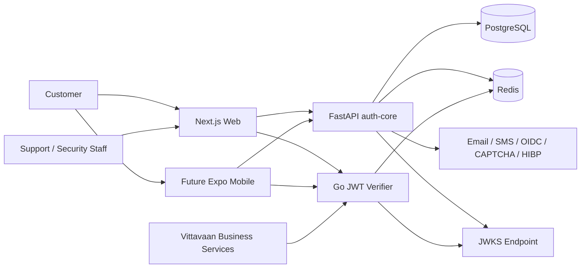
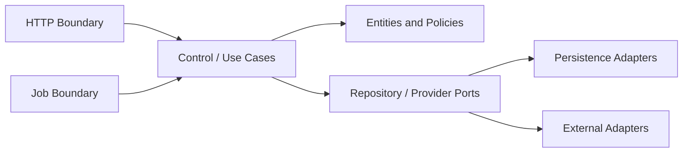

# System Architecture

## Architectural Goals

- Centralize identity, authentication, session, tenant, and authorization concerns.
- Keep domain rules independent of frameworks and infrastructure.
- Support web now and mobile later through the same versioned API.
- Fail closed when a security dependency is unavailable.
- Make staging inexpensive without coupling production to staging vendors.
- Allow downstream services to validate access quickly and consistently.

## System Context

## Runtime Containers

| Container | Responsibility |
|---|---|
| Next.js web | Approved customer/admin screens, accessibility, API client, web session handling. |
| FastAPI service | REST boundaries, use-case controls, entities, repositories, integrations, token issuance. |
| Go verifier | High-throughput JWT/JWKS validation, revocation checks, request identity context. |
| PostgreSQL | Durable users, identities, MFA metadata, sessions, tenants, governance, jobs, and audit. |
| Redis | OTPs, challenges, rate limits, revocation, short-lived workflow and risk state. |
| Worker | Durable delayed jobs, notifications, exports, cleanup, and key-rotation coordination. |

The MVP may run the worker process from the same image as the API, but it remains a separately invocable component so AWS can run it independently.

## Entity-Boundary-Control Structure

### Entity

Pure business concepts and invariants: users, identities, factors, token families, sessions, organizations, role bindings, governed requests, privacy requests, and audit events.

### Control

Transaction-level orchestration: registration, login, MFA, token rotation, recovery, organization management, support governance, privacy, and audit query.

### Boundary

FastAPI routes, Pydantic DTOs, generated OpenAPI, worker handlers, SQLAlchemy repositories, Redis gateways, OIDC clients, email/SMS providers, and cryptographic key providers.

## Dependency Rules

1. Boundary code may depend on controls and entities.
2. Controls may depend on entities and abstract ports.
3. Entities depend on standard-library concepts only.
4. SQLAlchemy models do not become domain entities.
5. HTTP DTOs do not flow directly into persistence.
6. External provider failures are translated into stable domain outcomes.
7. Transactions are owned by control-level units of work.

## Request Flow

1. Boundary validates transport, content type, client type, headers, authentication, and payload shape.
2. Middleware adds correlation ID, source network context, and safe telemetry.
3. Control authorizes the actor and runs the use case through ports.
4. Entity policies enforce state transitions and invariants.
5. Unit of work commits durable state and outbox events atomically.
6. Boundary maps the result to the documented response or RFC 7807 problem.
7. Worker asynchronously delivers notifications or performs delayed work.

## Public Trust Contract

Downstream services receive a verified identity context containing subject, token ID, issue/expiry time, client type, active organization, roles, and authentication assurance. Services must validate audience and required permissions; they must not accept unsigned client claims.

## Key Architecture Decisions

- Modular monolith first, with clear extraction seams; avoid premature microservice distribution.
- REST/OpenAPI as the client contract.
- Asymmetric JWT signing and public JWKS discovery.
- PostgreSQL as durable source of truth; Redis is never the only store for critical approvals.
- Transactional outbox for reliable asynchronous effects.
- Provider ports make Render/Neon/Upstash replaceable by AWS services.
