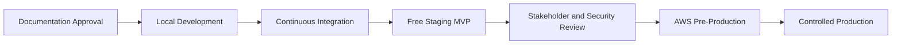

# Implementation Roadmap

## Delivery Method

Work proceeds through reviewable milestones. Each milestone must satisfy its documentation, automated testing, security, and demonstration gate before the next dependent milestone is considered complete.

## Milestones

| Milestone | Main deliverables | Exit gate |
|---|---|---|
| 0. Documentation baseline | Approved requirements, architecture, contracts, diagrams, inventories, and ADRs | Stakeholder approval and traceability review |
| 1. Monorepo foundation | Python, Next.js, Go, Docker Compose, configuration, CI skeleton | Local health checks and clean CI |
| 2. Persistence foundation | SQLAlchemy, Alembic, PostgreSQL schema, Redis keys, repositories, audit roles | Migration and isolation tests pass |
| 3. Registration and verification | Email/phone registration, CAPTCHA, HIBP, contact verification | UC-301 to UC-304 acceptance tests |
| 4. Primary authentication | Password, phone OTP, social OIDC, fallback, risk evaluation | UC-101 to UC-106 and UC-303/307 tests |
| 5. MFA and passkeys | TOTP, backup OTP, passkeys, enrollment, step-up | UC-201 to UC-204 tests |
| 6. Sessions and tokens | JWT/JWKS, refresh rotation, reuse detection, logout, timeouts, Go verifier | UC-401 to UC-405 tests and Python/Go interoperability |
| 7. Personal and organization workspaces | Private personal portfolios, optional organizations, referrals, invitations, roles, switching, offboarding | UC-305, UC-306, UC-308 to UC-310, UC-506 tests |
| 8. Recovery and governance | Password recovery, lockout, support recovery, suspension, four-eyes reset | UC-501 to UC-510 tests |
| 9. Privacy and audit | Audit search, GDPR export, anonymization, retention jobs | UC-505, UC-601, UC-602 tests |
| 10. Web experience | Approved wireframes implemented and connected to APIs | Browser E2E, accessibility, and responsive review |
| 11. Staging release | Render, Neon, Upstash, sandbox integrations, demo data and runbook | Public review URL and smoke tests |
| 12. AWS production hardening | AWS infrastructure, KMS, monitoring, backups, WAF, DR, security review | Production-readiness approval |

## Cross-Cutting Work in Every Milestone

- Documentation and traceability updates.
- Threat-model and privacy review.
- Structured audit events without secrets.
- Unit, integration, contract, and negative-path tests.
- Dependency and container vulnerability checks.
- Accessibility and user-safe error handling.
- Reviewable pull request with rollback notes.

## Definition of Done

A capability is complete only when:

1. Its behavior and API contract are documented.
2. Authorization and tenant boundaries are explicit.
3. Expected and failure paths have automated tests.
4. Sensitive events create redacted audit records.
5. Metrics and operational alerts are defined.
6. Web/mobile compatibility implications are documented.
7. User-facing screens were approved when new design work was required.
8. CI passes and reviewer feedback is resolved.

## Release Progression

