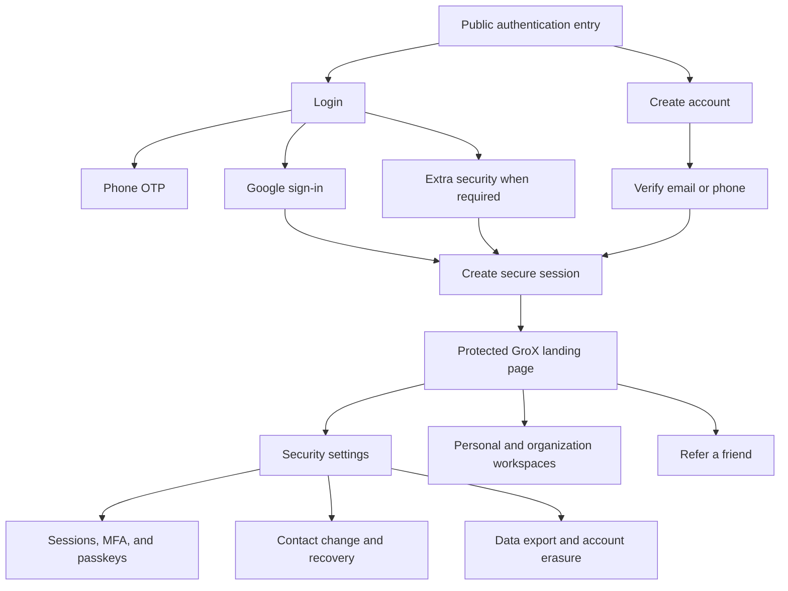

# Web Experience Implementation Plan

**Status:** Documentation proposal for project-owner review. No frontend screen, visual, or navigation change is authorized by this document.

## In Plain Language

The backend services are ready. Milestone 10 connects them to a website people can understand and use. The supplied GroX wireframes remain the visual baseline, but they currently cover only the first authentication journeys. This plan identifies what already exists, what is missing, where the wireframes conflict with the delivered security behavior, and the order in which approved screens should be implemented.

The website will call the same shared API used by the future mobile application. Security rules remain in the backend rather than being copied into either client.

## Wireframe Review

The supplied 11-page PDF uses a consistent desktop split layout: GroX brand, investment illustration and message on the left; focused authentication form on the right. Each page shows one or two form states.

| PDF page | Existing visual states | Backend alignment | Planning note |
|---|---|---|---|
| 1 | Mobile-number entry: empty and populated | Matches phone login/signup request APIs. | Clarify whether this entry point defaults to login, signup, or safely supports both. |
| 2 | Invalid mobile number; blank phone OTP | Matches phone validation and OTP challenge. | Keep validation local where possible; backend remains authoritative. |
| 3 | Partially entered and complete phone OTP | Matches phone confirmation. | Implement one accessible input with segmented visual presentation, paste support, and numeric keyboard. |
| 4 | Invalid OTP; blank email signup | Matches safe OTP rejection and email signup. | Add expiry, attempt limit, resend countdown, and temporary provider failure states. |
| 5 | Populated signup; enabled and disabled registration | Matches email signup fields. | Add live password requirements and a clear account-verification next step. |
| 6 | Password mismatch; blank email login | Matches validation and password login. | Keep error messages attached to fields and announced to screen readers. |
| 7 | Populated login; invalid-login alert | Partly conflicts with safe login behavior. | Replace “User not found” with a generic message that does not reveal whether the email exists. |
| 8 | Forgot-password request: blank and populated | Matches the generic password-recovery request. | Always show the same confirmation whether or not the account exists. |
| 9 | Password-reset OTP: blank and populated | Does not match the delivered backend. | Recommend replacing this page with “Check your email” and expired-link/resend states; the backend uses a secure single-use link, not a reset OTP. |
| 10 | New password: blank and populated | Matches secure-link password reset. | Add password requirements, show/hide, and link-expiry handling. |
| 11 | Password mismatch | Matches local and backend validation. | Add reset-complete confirmation and a clear return-to-login action. |

## Recommended MVP Navigation

### Public Routes

| Proposed route | Purpose | Visual status |
|---|---|---|
| `/login` | Password, phone, Google, and passkey entry. | Baseline exists; missing states need approval. |
| `/signup` | Email or phone account creation. | Baseline exists; verification states need approval. |
| `/verify-phone` | Phone OTP confirmation. | Baseline exists; expiry/resend states need approval. |
| `/verify-email` | Email sent, completed, expired, or already-used handling. | Missing design. |
| `/forgot-password` | Generic recovery request. | Baseline exists. |
| `/reset-password` | Secure-link new-password form and completion. | Partial baseline; replace reset OTP after approval. |
| `/auth/callback` | Safe social-provider return, cancellation, and retry. | Missing design. |
| `/mfa` | Method chooser and email, SMS, or authenticator challenge. | Missing design. |
| `/passkeys` | Passkey explanation, browser handoff, retry, and fallback. | Missing design. |

### Signed-In User Routes

| Proposed route | Purpose | Visual status |
|---|---|---|
| `/app` | Protected handoff/landing page after authentication. | Missing design; financial dashboard content remains outside `auth-core`. |
| `/settings/security` | MFA factors, passkeys, backup methods, and contact security. | Missing design. |
| `/settings/sessions` | Active devices, selected sign-out, and sign-out everywhere. | Missing design. |
| `/settings/privacy` | Export status/download and guarded account erasure. | Missing design. |
| `/workspaces` | Personal portfolio context plus optional organizations. | Missing design. |
| `/organizations/{id}/members` | Invitations, members, roles, and offboarding. | Missing design. |
| `/referrals` | Invite friends and view privacy-safe referral status. | Missing design. |

### Protected Staff Routes

| Proposed route | Purpose | Recommendation |
|---|---|---|
| `/staff/recovery` | Authorized unlock, suspension, and support recovery. | Build only after user MVP flows and staff wireframe approval. |
| `/staff/mfa-resets` | L2 initiation, L3 approval, waiting period, and execution status. | Keep separate from customer navigation. |
| `/staff/audit` | Authorized, redacted, paginated audit review. | Keep separate and invisible to ordinary users. |

## Screen-to-Service Map

| Screen group | Shared API operations |
|---|---|
| Email signup and verification | `POST /auth/signup`, `POST /auth/verify/email/request`, `POST /auth/verify/email` |
| Phone signup/login and OTP | `POST /auth/signup/phone`, `POST /auth/login/phone/request`, `POST /auth/login/phone/confirm`, `POST /auth/verify/phone/request`, `POST /auth/verify/phone/confirm` |
| Password and social login | `POST /auth/login`, `GET /auth/sso/{provider}/authorize`, `POST /auth/sso/{provider}/callback`, `POST /auth/identities/collision/prove` |
| MFA and fallback | `GET /auth/fallback-options`, `GET /auth/mfa/methods`, `POST /auth/mfa/challenge`, `POST /auth/mfa/challenge/resend`, `POST /auth/mfa/verify` |
| Authenticator and factor management | `POST /auth/mfa/totp/setup`, `POST /auth/mfa/totp/confirm`, `GET /auth/mfa/devices`, `DELETE /auth/mfa/devices/{mfa_id}` |
| Passkeys | `POST /auth/mfa/passkeys/options`, `POST /auth/mfa/passkeys/confirm`, `POST /auth/passkeys/options`, `POST /auth/passkeys/verify` |
| Browser session lifecycle | `POST /auth/session`, `POST /auth/refresh`, `POST /auth/logout`, `POST /auth/logout-all`, `GET /auth/sessions`, `DELETE /auth/sessions/{session_id}` |
| Workspaces and organizations | `GET /workspaces`, `POST /organizations`, organization invitation/member/role endpoints, `POST /auth/workspace/switch` |
| Personal referrals | `POST /referrals`, `GET /referrals` |
| Recovery and contact changes | `POST /auth/password/forgot`, `POST /auth/password/reset`, contact-change start and old/new verification endpoints |
| Staff recovery and governed reset | Admin unlock, suspend, recovery, and MFA-reset initiation/approval/execution/status endpoints |
| Audit review | `GET /admin/audit-logs` |
| Privacy | Export request/status/download and erasure request endpoints under `/privacy` |

All paths above use the `/api/v1` prefix. The frontend will consume generated or strongly typed contracts from the shared OpenAPI document rather than maintaining a separate handwritten interpretation.

## Implementation Order After Visual Approval

| Stage | Deliverable | Why this order |
|---|---|---|
| 1 | Design tokens, responsive authentication shell, accessible fields, buttons, alerts, and API client. | Creates one reusable foundation instead of rebuilding each form. |
| 2 | Email signup, email verification, password login, forgot password, and secure-link reset. | Covers the most familiar end-to-end account journey. |
| 3 | Phone login/signup and OTP states. | Reuses the authentication shell and code-entry component. |
| 4 | Google sign-in, collision proof, MFA, authenticator setup, backup codes, and passkeys. | Adds advanced security after the primary path is stable. |
| 5 | Protected landing, sessions, security settings, personal workspace, organizations, and referrals. | Connects signed-in account management without inventing financial portfolio features. |
| 6 | Privacy export, erasure, and approved staff tools. | Places destructive and privileged workflows behind the strongest tested foundation. |
| 7 | Browser end-to-end, keyboard, screen-reader, responsive, and error-state review. | Validates complete journeys before public stakeholder deployment. |

## Recommended Changes Requiring Approval

1. **Use generic login failure copy.** Proposed wording: “We couldn't sign you in. Check your details and try again.” This prevents account discovery.
2. **Replace password-reset OTP with a secure-link journey.** After the generic request response, show “Check your email”; the link opens the new-password form. Include expired, already-used, resend, complete, and provider-unavailable states.
3. **Use one accessible OTP input.** It may look like six boxes, but paste, backspace, screen readers, and mobile autofill should treat it as one code.
4. **Give forms more space.** Preserve the illustration on wide screens, reduce it on tablets, and prioritize the form on phone-sized screens.
5. **Add short progress orientation.** Signup can show `Account details -> Verification -> Complete`; avoid adding progress to one-step login.
6. **Use Google first for MVP.** Keep Apple and Microsoft adapters available in the API, but do not show buttons until provider credentials and product approval exist.
7. **Separate customer and staff navigation.** Staff tools should never appear simply because a URL is known; backend authorization remains mandatory.
8. **Keep the protected landing page modest.** It should hand off to GroX account/workspace areas and must not invent portfolio-management functionality inside `auth-core`.

## Required Owner Decisions Before Frontend Work

| Decision | Recommended choice |
|---|---|
| Existing visual direction | Keep the GroX split-screen identity, colors, illustration, and simple form style. |
| Unsafe invalid-login wording | Approve the generic non-enumerating replacement. |
| Password-reset mismatch | Approve secure email-link states instead of the wireframed reset OTP. |
| Missing screen design | Approve creating reviewable desktop and phone-sized wireframes in staged groups before implementation. |
| MVP identity providers | Show Google only; add Apple/Microsoft later when credentials and product priority are approved. |
| Staff tools | Defer visual implementation until customer journeys are complete and separately approved. |
| Initial implementation scope | Start with Stage 1 and Stage 2 only after the visual states for those stages are approved. |

## Explicit Boundary

This plan does not approve or implement any frontend change. The next permitted action, if approved, is to prepare reviewable wireframes or equivalent visual mockups for Stage 1 and Stage 2. Application code begins only after those visuals are accepted.
