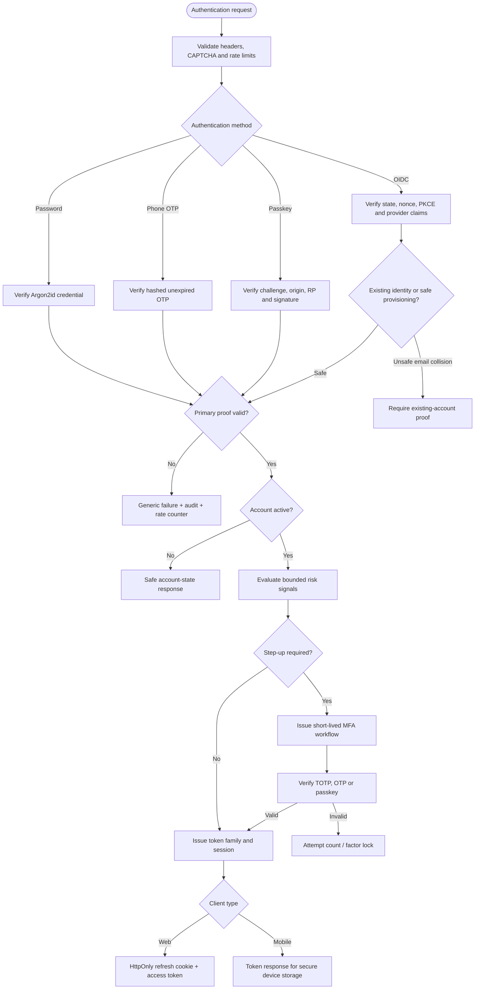
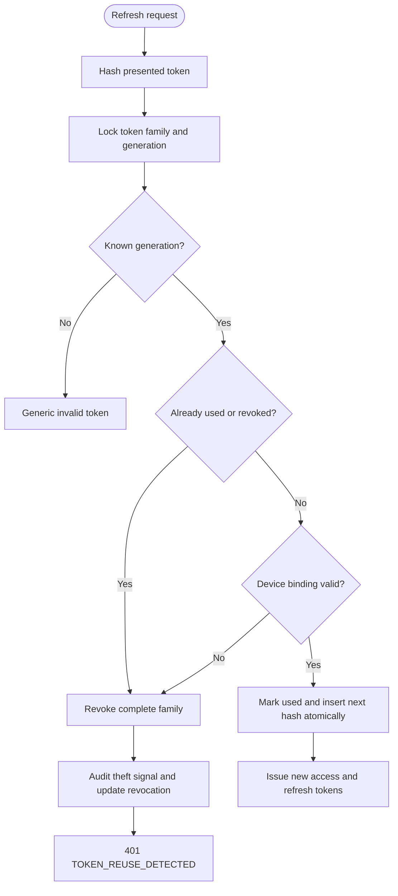
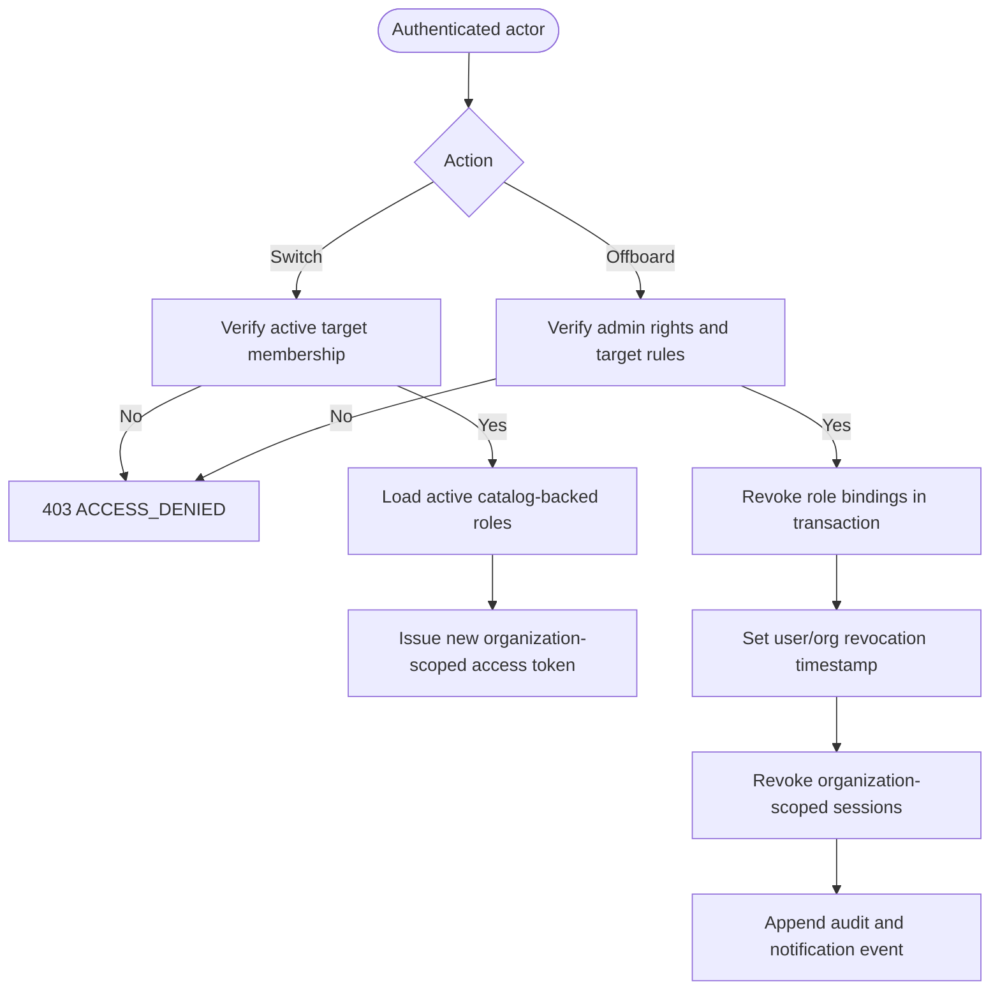
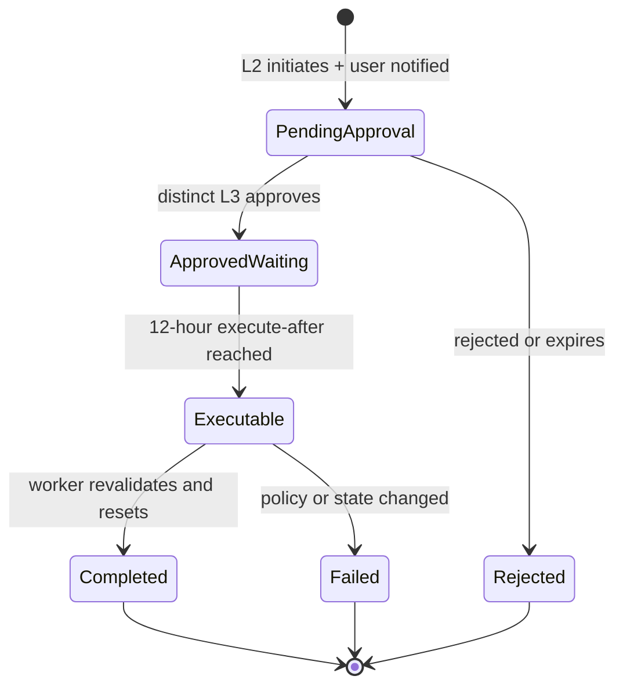
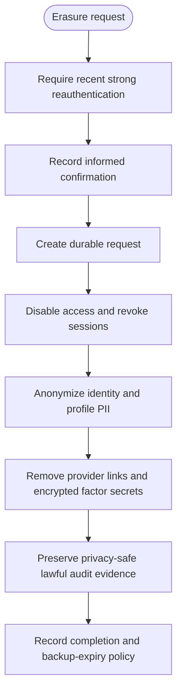

# Auth-Core Functional Flowcharts

## Authentication Decision Flow

## Refresh Rotation and Theft Detection

## Organization Context and Offboarding

## Four-Eyes MFA Reset

## GDPR Erasure

## Error Outlet Rules

- Invalid credentials and password-reset requests do not disclose account existence.
- Dependency outages return retryable generic errors and do not bypass checks.
- Replayed workflow tokens are rejected idempotently.
- Authorization failure never falls back to client-supplied roles.
- Every security-significant result writes a redacted outcome event.
