# System Sequence Diagrams Specification (`auth-core`)

**Module:** Authentication & User Management Engine (`auth-core`)  
**Version:** 2.1.0  
**Architecture Style:** Object-Oriented Software Engineering (OOSE) - Entity-Boundary-Control (EBC) Pattern  
**Target Environment:** Web (Next.js) & Mobile (React Native / Expo)  

---

## 1. Overview & Architectural Coverage

This document contains the complete dynamic interaction models for the `auth-core` module. In accordance with Object-Oriented Software Engineering (OOSE) principles, sequence diagrams capture the dynamic message exchanges between **Boundary Objects («boundary»)**, **Control Objects («control»)**, and **Entity Objects («entity»)** across time.

To maintain a clean, maintainable architecture, sequence diagrams are organized by **Primary Collaboration Patterns**. Each pattern models a core workflow or high-risk exception loop. Every use case defined in the primary specification (`auth_module_specification_v2.1.md`) maps directly to one of these 8 sequence diagram patterns.

### Architectural Use Case Coverage Matrix

| Sequence Diagram Pattern | Primary Use Case Modeled | Covered Equivalent / Derived Use Cases |
| :--- | :--- | :--- |
| **1. Adaptive Risk Login + Step-Up MFA** | `UC-101` (Password Authenticate)<br>`UC-106` (Adaptive Risk)<br>`UC-201` (TOTP Authenticate) | `UC-103` (Mobile Phone OTP Authenticate)<br>`UC-104` (Passkey / Biometric Authenticate)<br>`UC-202` (SMS/Email Secondary OTP)<br>`UC-203` (Passkey Secondary Step-up)<br>`UC-204` (MFA Setup & Enrollment) |
| **2. Token Family Rotation & Reuse Detection** | `UC-402` (Token Refresh & Rotation) | `UC-401` (Dual-Client Token Issue)<br>`UC-403` (Explicit Single Device Logout)<br>`UC-404` (Global Multi-Device Logout)<br>`UC-405` (Idle & Absolute Session Timeout) |
| **3. 4-Eyes Governed Admin MFA Reset** | `UC-508` (Admin MFA Reset - 4-Eyes) | `UC-503` (Account Lockout Release)<br>`UC-504` (Admin Account Suspend/Disable)<br>`UC-507` (Support-Assisted Account Recovery) |
| **4. Self-Service Registration & Breach Check** | `UC-301` (Self-Service Email Reg)<br>`UC-302` (Email Address Verification) | `UC-304` (Phone-Based Quick Registration)<br>`UC-501` (Forgotten Password Request)<br>`UC-502` (Password Reset Execution) |
| **5. SSO Login & Account Collision Prevention** | `UC-102` (Social SSO Authenticate)<br>`UC-303` (SSO Auto-Provisioning)<br>`UC-307` (SSO Collision Resolution) | All third-party OIDC/OAuth provider integrations (Google, Apple, Microsoft) & social provider identity linking/unlinking |
| **6. Multi-Tenant Context Switching** | `UC-306` (Organization Context Switch) | `UC-305` (Organization Creation & Member Invite)<br>`UC-506` (Role & Permission Assignment)<br>`UC-509` (Self-Service Active Session Management) |
| **7. Organization Member Offboarding** | `UC-308` (Org Member Offboarding) | Admin-driven workspace access revocation, role binding deletion, and real-time tenant session termination |
| **8. GDPR Account Erasure & Anonymization** | `UC-602` (GDPR Account Erasure) | `UC-601` (GDPR Data Export / Right of Access) |

---

## 2. Mermaid Sequence Diagrams

---

### Sequence Diagram 1: Adaptive Risk-Based Login + Mandatory MFA (`UC-101`, `UC-106`, `UC-201`)

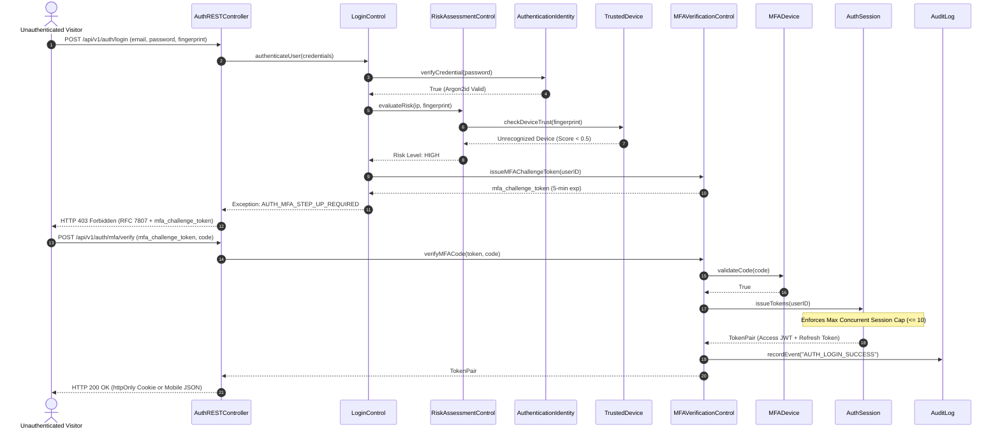

---

### Sequence Diagram 2: Token Family Rotation & Reuse Theft Detection (`UC-402`)

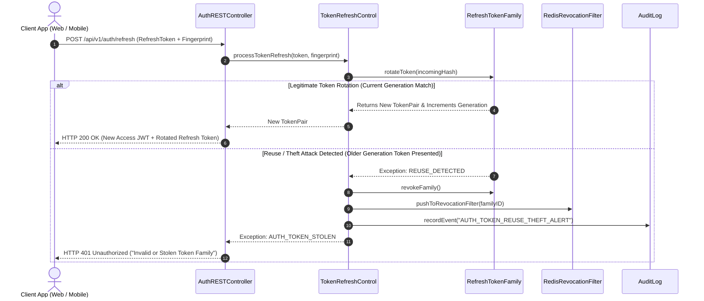

---

### Sequence Diagram 3: 4-Eyes Governed Admin MFA Reset (`UC-508`)

```mermaid
sequenceDiagram
    autonumber
    actor L2Agent as Customer Support L2
    actor L3Supervisor as Security Supervisor L3
    participant AdminBoundary as AdminPortalRESTController
    participant AdminCtrl as SupportAdminControl
    participant MFADev as MFADevice
    participant Session as AuthSession
    participant SMS as SMSGatewayAdapter
    participant Audit as AuditLog

    L2Agent->>AdminBoundary: POST /api/v1/admin/mfa-reset/initiate (targetUserID, ticketRef)
    AdminBoundary->>AdminCtrl: initiateSupportReset(agentID, targetUserID, ticketRef)
    AdminCtrl->>SMS: sendSMSCode(userPhone, "MFA Reset Requested by Support")
    AdminCtrl-->>AdminBoundary: Request Created (Status: PENDING_APPROVAL)
    AdminBoundary-->>L2Agent: HTTP 202 Accepted (Pending L3 Approval)

    L3Supervisor->>AdminBoundary: POST /api/v1/admin/mfa-resets/{id}/approve
    AdminBoundary->>AdminCtrl: approveSupportReset(supervisorID, requestID)
    AdminCtrl->>Audit: recordEvent("ADMIN_MFA_RESET_APPROVED")
    AdminCtrl-->>AdminBoundary: Approved; execution remains delayed
    Note over AdminCtrl: Mandatory 12-hour protection delay elapses
    L3Supervisor->>AdminBoundary: POST /api/v1/admin/mfa-resets/{id}/execute
    AdminBoundary->>AdminCtrl: executeSupportReset(supervisorID, requestID)
    Note over AdminCtrl: Revalidate roles, distinct actors, target version, state, and delay
    AdminCtrl->>MFADev: revokeDevice(targetUserID)
    AdminCtrl->>Session: revokeAllSessions(targetUserID)
    AdminCtrl->>Audit: recordEvent("ADMIN_MFA_RESET_EXECUTED")
    AdminCtrl-->>AdminBoundary: Reset Complete
    AdminBoundary-->>L3Supervisor: HTTP 200 OK (MFA Reset Finalized)
```

---

### Sequence Diagram 4: Self-Service Registration & k-Anonymity Breach Check (`UC-301`, `UC-302`)

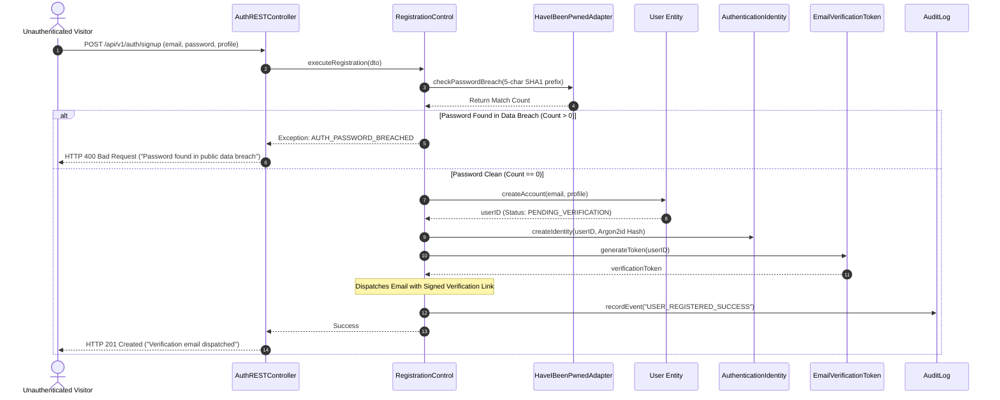

---

### Sequence Diagram 5: Social SSO Login, Auto-Provisioning & Account Collision Prevention (`UC-102`, `UC-303`, `UC-307`)

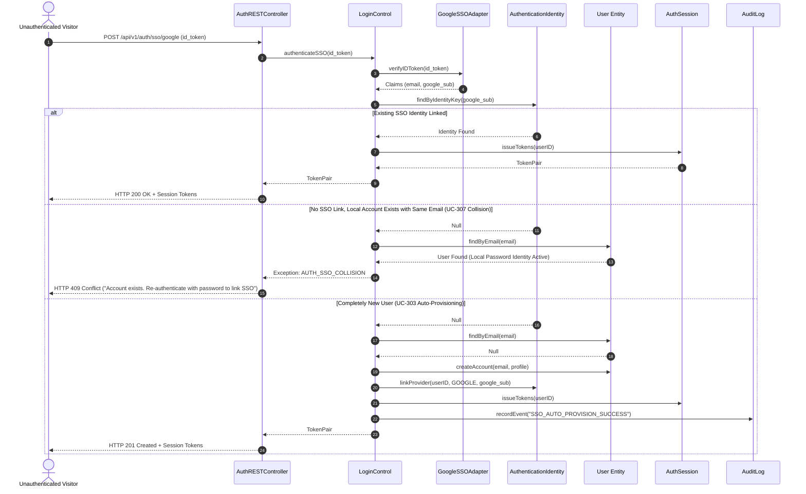

---

### Sequence Diagram 6: Multi-Tenant Organization Context Switching (`UC-306`)

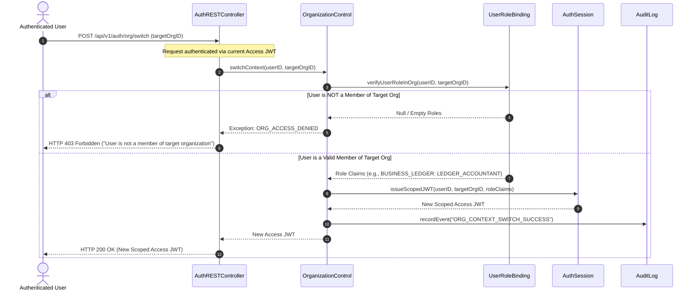

---

### Sequence Diagram 7: Organization Member Offboarding (`UC-308`)

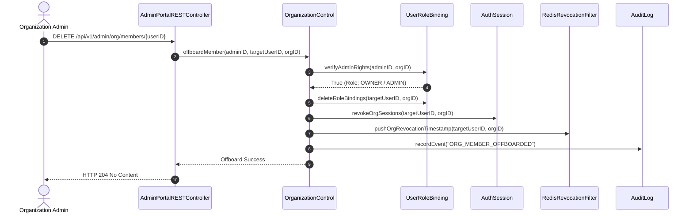

---

### Sequence Diagram 8: GDPR Account Erasure / Right to be Forgotten (`UC-602`)

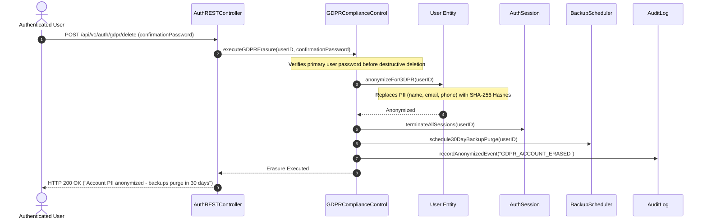

---

### Sequence Diagram 9: Password Recovery and Session Revocation (`UC-501`, `UC-502`)

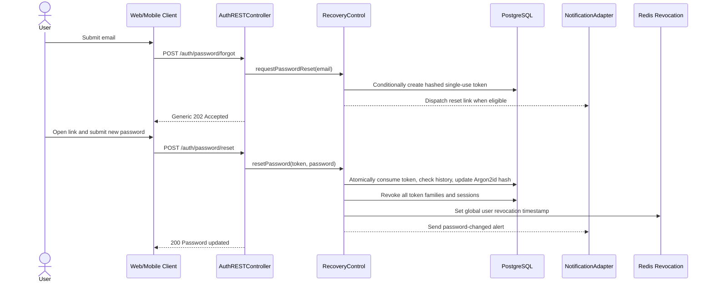

### Sequence Diagram 10: MFA Enrollment (`UC-204`)

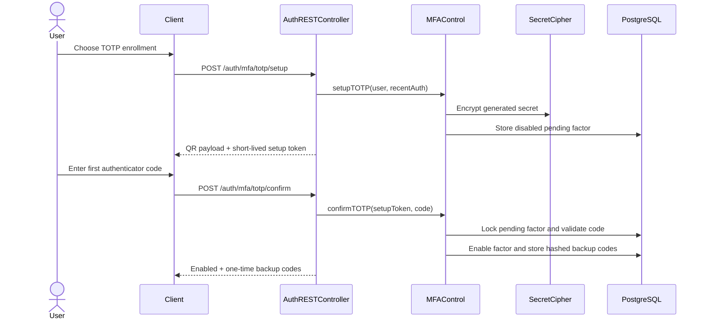

### Sequence Diagram 11: Session Inspection and Selective Revocation (`UC-509`)

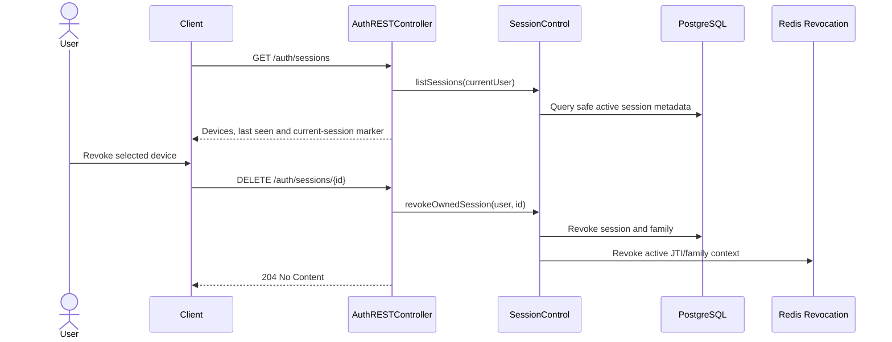

### Sequence Diagram 12: Contact Change With Dual Verification (`UC-510`)

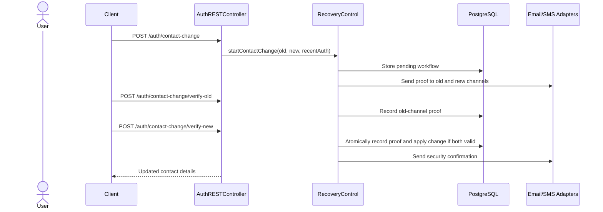

### Sequence Diagram 13: Personal Workspace Provisioning (`UC-309`)

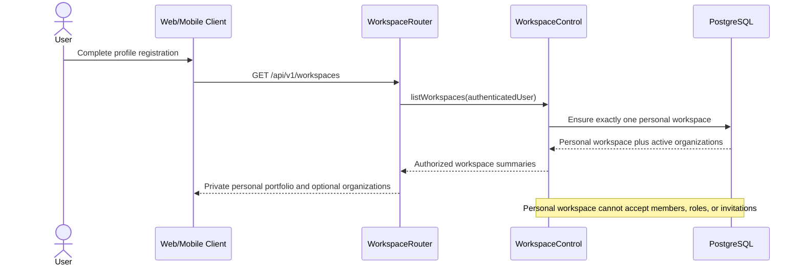

### Sequence Diagram 14: Personal Referral Attribution (`UC-310`)

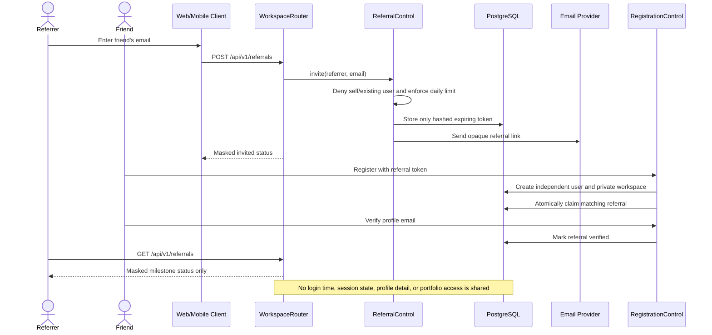
